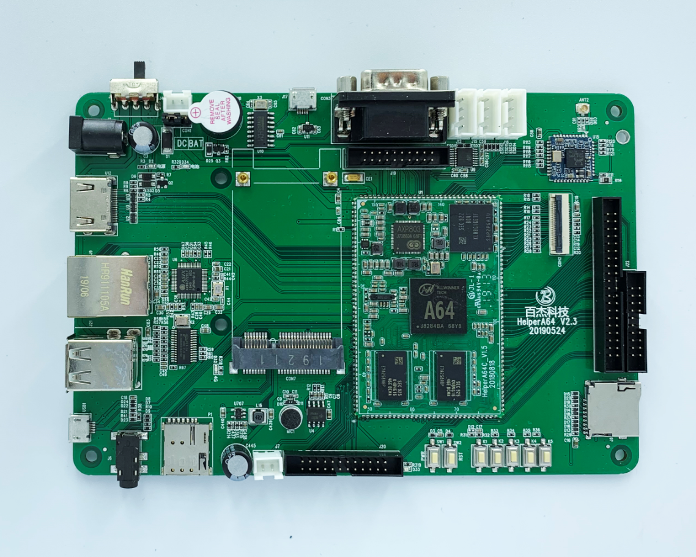

### helperboard

**公司**：深圳市百杰科技有限公司

**地址**：深圳市宝安区西乡街道宝源路宝安互联网产业基地A区5栋3楼306

**网址**：https://www.szbaijie.com/

**淘宝**：https://spacexplorer.taobao.com/?spm=2013.1.1000126.3.18641294Hn65iW

**阿里巴巴**：https://bjkj.en.alibaba.com/

#### helperboard-a64开发板

##### 板子参数：

CPU：64 位 4 核 A53 最高主频：1.1GHz 、内存：1GB、存储：8G EMMC （MLC 非 TLC）

显示：支持 HDMI 输出 4K@30Hz， 1080P@60Hz，LVDS 1366x768@60Hz, MIPI1920x1080@60Hz，RGB 1920x1080@60Hz

2 路高速 USB HOST，1 路高速 USB OTG

4 路 TTL 串口（可做普通 IO 口）

一路 40 针 RGB TTL LCD 接口，可支持各种 RGB 接口液晶屏，最高 1920x1200@60Hz

一路 20 针 LVDS TTL LCD 接口，可支持各种 LVD 接口液晶屏，最高 1366x768@60Hz

1 路 TF 卡接口，1 路引出 SDIO 接口

1 路 CSI 摄像头接口，可做分时前后双摄，完整供电，最高支持 5M 像素(摄像需另配)

1 路耳机输出、1 路 LINEOUT 输出、1 路 MIC 接口、一路喇叭输出接口，支持外置 4 欧 2W 输出

1 路 PWM，可接背光控制1 个蜂鸣器、5 个普通按键

内置 USB 转串口，直接插 USB 就能看串口调试信息

1 路 10/100BASE 以太网接口、1 路 2.4G WIFI 接口

扩展 24 针GP IO 接口，其中包括 14 个 3.3V 普通 IO 口，1 路 I2C，4 个 1.8V 普通 IO 口，两个 3.3V 电源

供电：DC 5V、电池 3.7V、两个地

#### helperboard-a133开发板

研发中。。。
