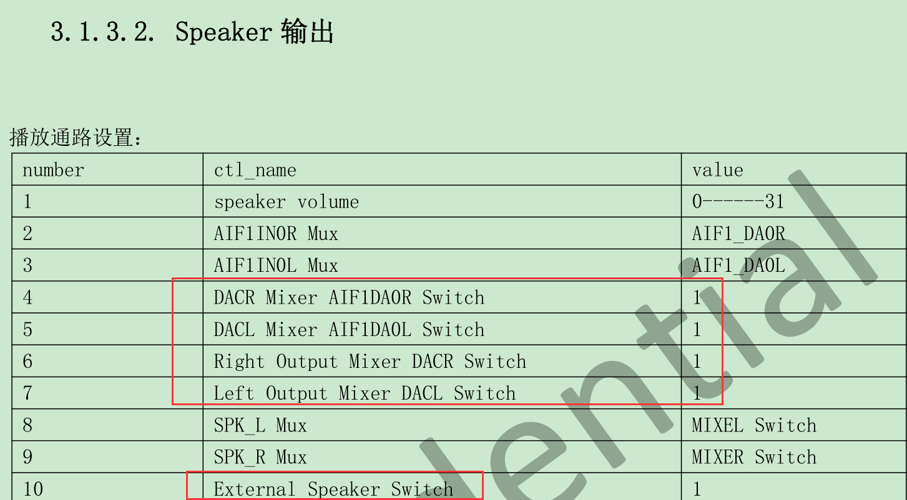
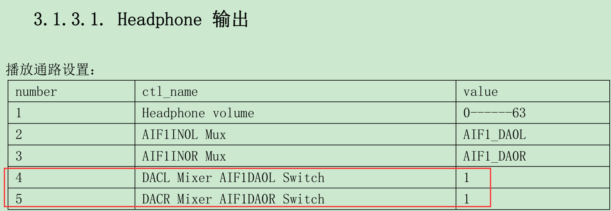

## 在helperboard a64下修改开机bootlogo的BUG**

### 环境：

- 芯片：全志a64　　
- 内核：Linux3.10内核
- 主机：ubuntu16.04
- 开发板：[helperboard a64](https://item.taobao.com/item.htm?spm=a230r.1.14.27.6f7076ffgIj8Ws&id=563738220031&ns=1&abbucket=3#detail)
- 公司：[百杰科技](https://www.szbaijie.com/)
- github：[Baijie Technology](https://github.com/jizizh/helperboard.git)

### 声卡调试

通过amixer来配置我们a64内核4.9的声卡，效果如下:

```shell
amixer cset numid=27,iface=MIXER,name='Headphone Switch' on 1>/dev/null 2>&1 &
amixer cset numid=56,iface=MIXER,name='DACL Mixer AIF1DA0L Switch' on 1>/dev/null 2>&1 &
amixer cset numid=60,iface=MIXER,name='DACR Mixer AIF1DA0R Switch' on 1>/dev/null 2>&1 &
amixer cset numid=26,iface=MIXER,name='External Speaker Switch' on 1>/dev/null 2>&1 &
amixer cset numid=62,iface=MIXER,name='Left Output Mixer DACL Switch' on 1>/dev/null 2>&1 &
amixer cset numid=61,iface=MIXER,name='Left Output Mixer DACR Switch' on 1>/dev/null 2>&1 &
amixer cset numid=43,iface=MIXER,name='AIF1 AD0L Mixer ADCL Switch' on 1>/dev/null 2>&1 &
amixer cset numid=47,iface=MIXER,name='AIF1 AD0R Mixer ADCR Switch' on 1>/dev/null 2>&1 &
amixer cset numid=50,iface=MIXER,name='AIF1 AD1L Mixer ADCL Switch' on 1>/dev/null 2>&1 &
amixer cset numid=52,iface=MIXER,name='AIF1 AD1R Mixer ADCR Switch' on 1>/dev/null 2>&1 &
amixer cset numid=93,iface=MIXER,name='LADC input Mixer MIC1 boost Switch' on 1>/dev/null 2>&1 &
```

#### speaker输出

查阅到全志音频配置文档如下：



然后通过amixer来调试：

```shell
amixer contents | grep "DACL Mixer AIF1DA0L Switch"
```

得到 numid：

```shell
numid=56,iface=MIXER,name='DACL Mixer AIF1DA0L Switch'
```

然后查看下状态：

```shell
amixer cget numid=56
```

设置声卡：

````shell
amixer cset numid=56,iface=MIXER,name='DACL Mixer AIF1DA0L Switch' on 1>/dev/null 2>&1 &
````

其他的适配也和这个一样，下面是需要适配的选项。

#### 录音与耳机




