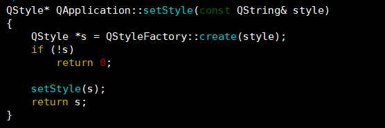
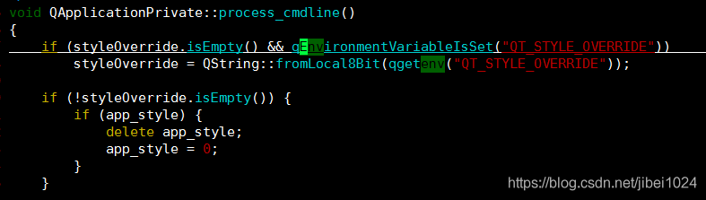
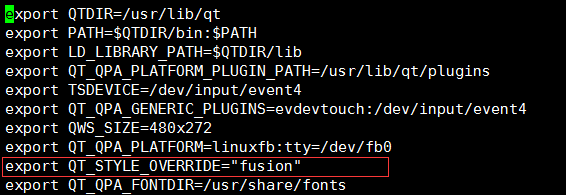

## 修改Qt中checkbox图片太小的BUG

### 环境：

- 芯片：全志a64　　
- 内核：Linux3.10内核
- 主机：ubuntu16.04
- 开发板：[HelperBoard-A64](https://item.taobao.com/item.htm?spm=a230r.1.14.27.6f7076ffgIj8Ws&id=563738220031&ns=1&abbucket=3#detail)
- 公司：[百杰科技](https://www.szbaijie.com/)
- github：[Baijie  Technology](https://github.com/jizizh/baijie_blog)

### 问题：

在从Qt4移植为Qt5时遇到很多问题，这次是移植到开发板中风格的问题，代码在PC正常显示，移植到arm板中checkbox中图标icon选中勾明显太小。

### 一、fusion风格

1、Qt5有几个风格，其中就是window版本的风格和fusion风格，windows版本的就是icon勾太小，而fusion风格的就是正常的。网上给的答案就是在main.c中加入风格切换，的确能正常显示。

2、不足之处：在每次代码中加入风格切换这是不合理的，所以我们在arm开发板中修改，使其默认为fusion风格。找到Qt源码调用的地方，分析原因。

### 二、修改不足

1、上面只是调用不是问题处。最后分析得到是HelperA64开发板中默认环境变量为windows，所以我们找到Qt源码中环境变量的地方如下：

分析得出当没有设置风格时，arm板子默认为widows风格。我们得到的环境变量为QT_STYLE_OVERRIDE。

2、得到环境变量后只需要在我们开发板脚本export就行了

### 三、总结

​    出现问题时能一劳永逸的事情我们就要做好，不畏惧源码的庞大，勇敢向前，总会有突破口的。