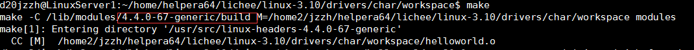
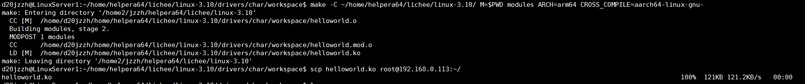
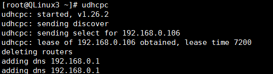
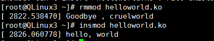

## 目标：在helperboard a64下创建helloword模块

### 环境：

- 芯片：全志a64　　
- 内核：Linux3.10内核
- 主机：ubuntu16.04
- 开发板：[helperboard a64](https://item.taobao.com/item.htm?spm=a230r.1.14.27.6f7076ffgIj8Ws&id=563738220031&ns=1&abbucket=3#detail)
- 公司：[百杰科技](https://www.szbaijie.com/)
- github：[Baijie Technology](https://github.com/jizizh/baijie_blog)

### 一、helloworld.ko

```c
#include<linux/init.h>
#include<linux/module.h>

static int hello_init(void)
{
    printk(KERN_ALERT "szbaijie hello init\n");
    return 0;
}

static void hello_exit(void)
{
    printk(KERN_ALERT "szbaijie hello exit\n");
}

module_init(hello_init);
module_exit(hello_exit);
MODULE_AUTHOR("baijie");
MODULE_LICENSE("GPL");
```

### 二、出现问题

当出先下面错误时候，查找问题，命令dmesg |tail查看下打印LOG。


查出来是Make的时候默认为PC-X86的编译器，所以我们需要切换为arm编译器来交叉编译。



### 三、切换为arm交叉编译环境

#### 1、修改bash.bashrc

方法一：修改~/.bashrc文件（此文件只对当前用户适用），命令如下：

```shell
sudo vi ~/.bashrc
```

在文件最后加入：

```shell
export PATH=~/helpera64/lichee/out/external-toolchain/gcc-aarch64/bin:$PATH
```

#### 2、修改profile

方法二：修改/etc/profile文件（此文件属于系统级别的环境变量，设置在里面的东西对所有用户适用）：

```shell
sudo vi /etc/profile
export PATH=~/helpera64/lichee/out/external-toolchain/gcc-aarch64/bin:$PATH
```

#### 3、立即使能环境变量（不用重启）：

对应方法一：

```shell
source /root/.bashrc
```

对应方法二：

```shell
source /etc/profile
```

#### 4、测试是否安装成功

```shell
aarch64-linux-gnu-gcc -v
```

#### 5、直接编译内核和模块（**不使用Makefile**）:

交叉编译内核：

```
make -C ~/helpera64/lichee/linux-3.10/ ARCH=arm64 CROSS_COMPILE=aarch64-linux-gnu-
```

交叉编译编译模块：

```
make -C ~/home/helpera64/lichee/linux-3.10/ M=$PWD modules ARCH=arm64 CROSS_COMPILE=aarch64-linux-gnu-
```

如下图：



### 四、Makefile

```makefile
KERNELDIR :=~/lichee/linux-3.10/
ARCH :=arm64
CROSS_COMPILE :=aarch64-linux-gnu-
PWD :=$(shell pwd)
obj-m :=helloworld.o

default:
    $(MAKE) -C $(KERNELDIR) ARCH=$(ARCH) CROSS_COMPILE=$(CROSS_COMPILE) M=$(PWD) modules
clean:
    rm *.o *.ko *.mod.c *.order *.symvers .* -rf
```

### 五、测试结果

#### 1、开启ssh

将网络打开ifconfig eth0 up，之后执行下面命令来启动ssh。

```shell
/etc/init.d/S50sshd restart
```

 然后使用udhcpc来打开网络，如下图。



然后将helloworld.ko远程拷贝到helpera64开发板上。

#### 2、测试结果



