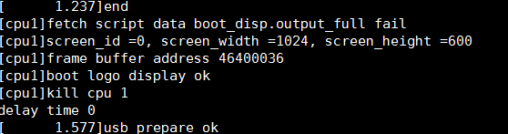
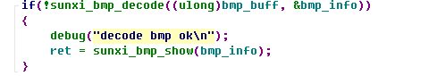
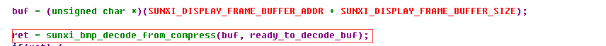
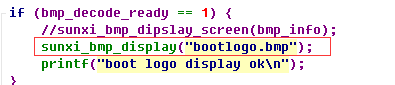

## 在helperboard a64下修改开机bootlogo的BUG**

### 环境：

- 芯片：全志a64　　
- 内核：Linux3.10内核
- 主机：ubuntu16.04
- 开发板：[helperboard a64](https://item.taobao.com/item.htm?spm=a230r.1.14.27.6f7076ffgIj8Ws&id=563738220031&ns=1&abbucket=3#detail)
- 公司：[百杰科技](https://www.szbaijie.com/)
- github：[Baijie Technology](https://github.com/jizizh/baijie_blog)

### 问题

1、24bit深度的bootlogo.bmp图片会导致Qt5有色差，32位的图片没有色差。

2、将开机bootlogo图片修改为32位图片只有部分图片能够点亮屏就显示，大部分图片没有在开机uboot中显示，只在内核中显示

### 一、查找bug

1、查找uboot开机显示图片的地方，寻找源码BUG地方

2、通过bmp格式解析发现没错，调用开机bootlogo解码和显示主要如下

### 二、BUG原因

1、helperA64每次开机都会执行下图代码，这代码是lzma解压。部分图片执行解压很快，而大部分bmp图片就在这里卡住了多达四五秒时间等待，这是uboot快速启动所不能接受的。

2、uboot开机时开始时为多线程，导致解析图片产生资源冲突，查到start.S中先调用sunxi_secendary_cpu_task然后是sunxi_third_cpu_task。

### 三、修改bug

修改开机bootlogo调用，禁掉lzma解压，修改如下图使其32位图片能正常在uboot和内核显示

